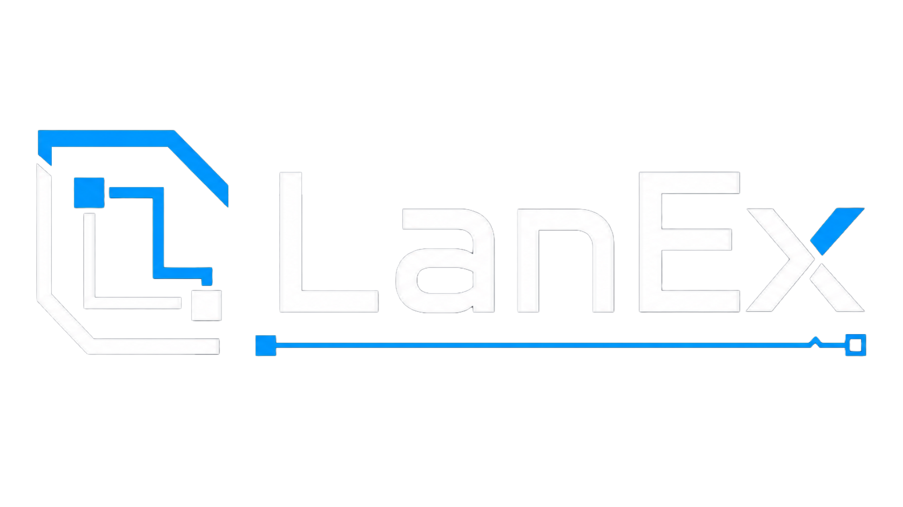
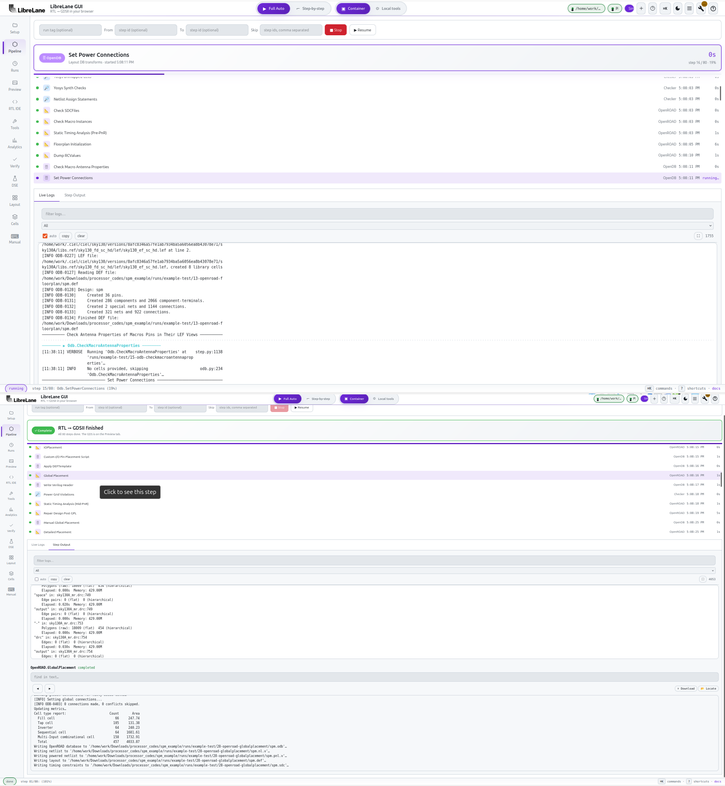
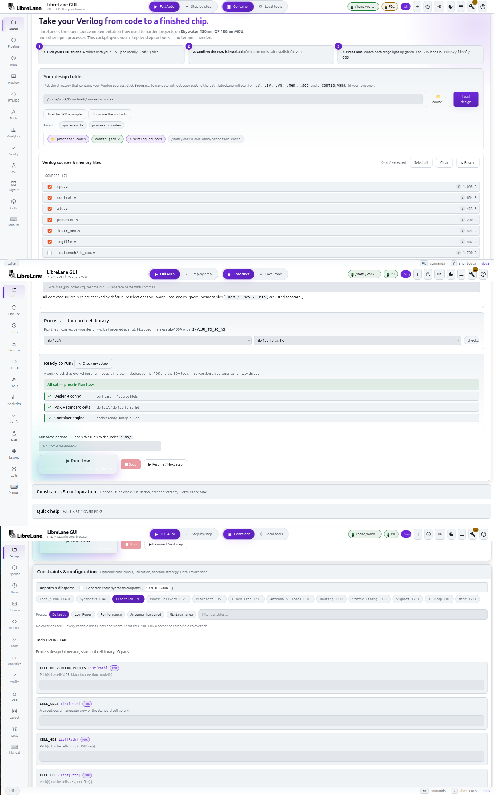
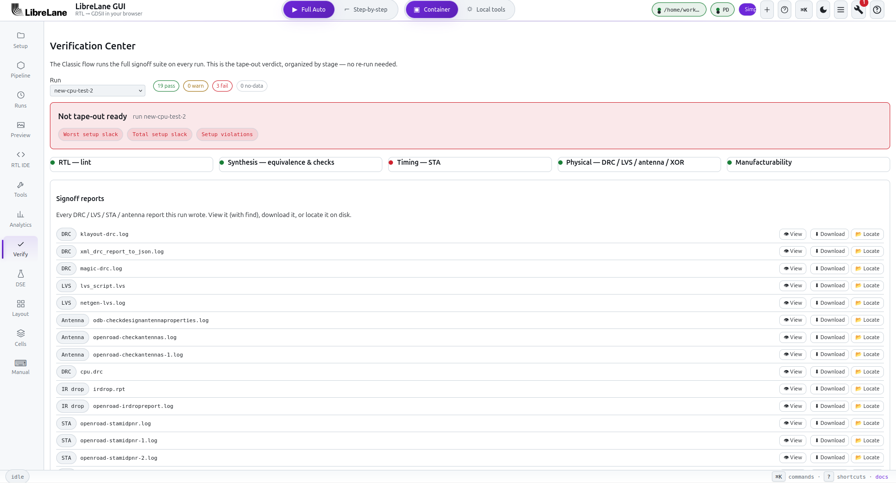
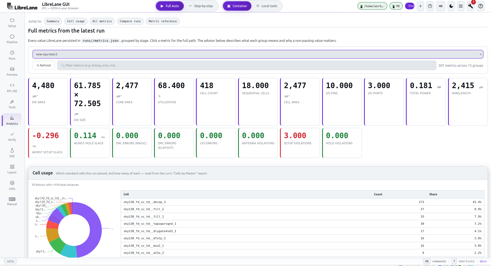
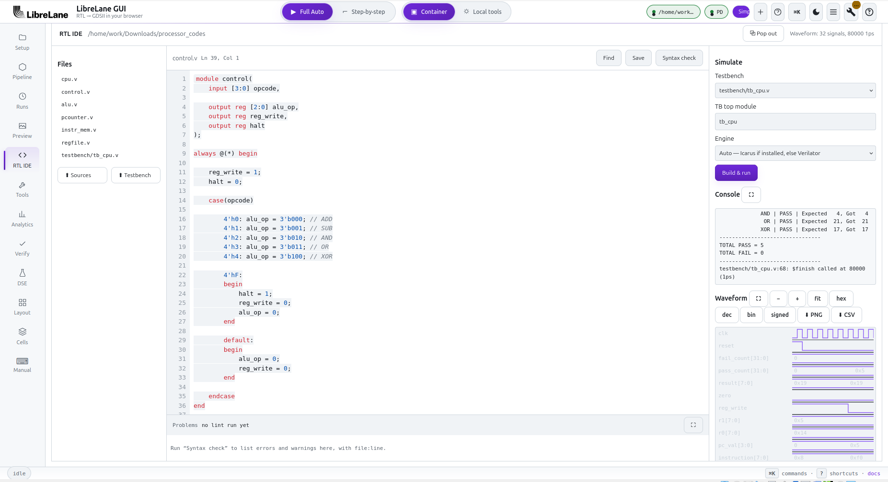
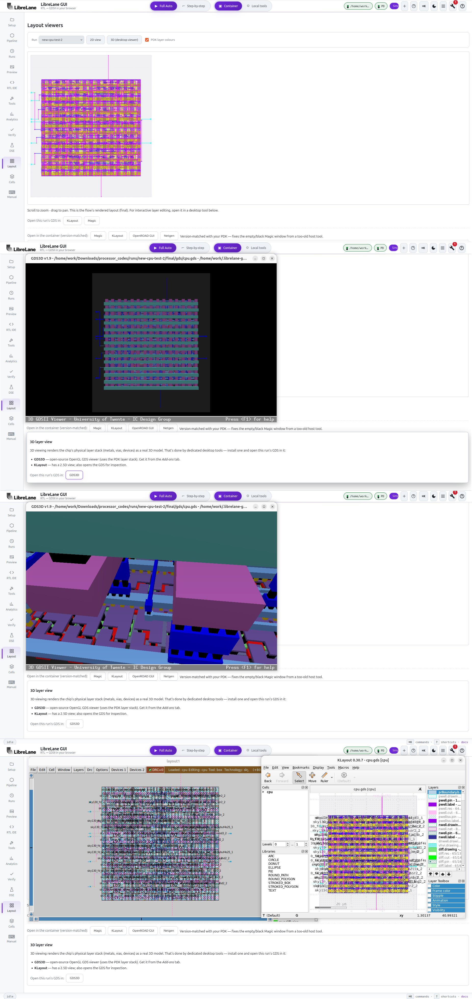
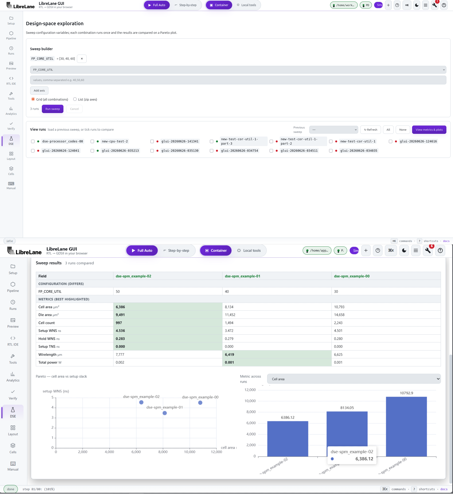

<!-- LanEx — README -->
<div align="center">



### Take Verilog all the way to silicon — without living in a terminal.

A browser cockpit &amp; IDE for the [**LibreLane**](https://github.com/librelane/librelane) RTL&nbsp;→&nbsp;GDSII chip flow.

<br>

[](LICENSE)
[](https://www.python.org/)
[](#architecture)
[](#testing)
[](https://github.com/librelane/librelane)

<a href="#install"><b>Install</b></a> &nbsp;·&nbsp;
<a href="#quickstart"><b>Quickstart</b></a> &nbsp;·&nbsp;
<a href="#the-cockpit"><b>The&nbsp;cockpit</b></a> &nbsp;·&nbsp;
<a href="#gui--cli"><b>GUI&nbsp;↔&nbsp;CLI</b></a> &nbsp;·&nbsp;
<a href="#architecture"><b>Architecture</b></a>

<br>



</div>

---

> ### ⚠&nbsp; LanEx is a viewer, not a sign-off tool
>
> LanEx drives LibreLane and the EDA tools it orchestrates (OpenROAD, Yosys,
> Magic, KLayout, Netgen) and **displays their output**. It performs **no silicon
> analysis of its own** — every metric, report, and verdict it shows comes
> straight from those tools, passed through unmodified.
>
> **Do not fabricate from a LanEx verdict alone.** Before committing a design to
> manufacturing, always verify results against your foundry's official sign-off
> decks and your shuttle/MPW program's checks. LanEx is provided **AS&nbsp;IS,
> without warranty of any kind** (Apache-2.0 — see [LICENSE](LICENSE) and
> [NOTICE](NOTICE)).

---

## Contents

- [Why LanEx](#why-lanex)
- [The cockpit](#the-cockpit)
- [Install](#install)
- [Quickstart](#quickstart)
- [GUI ↔ CLI](#gui--cli)
- [Architecture](#architecture)
- [Testing](#testing)
- [Relationship to LibreLane](#relationship-to-librelane)
- [License](#license)

---

## Why LanEx

LibreLane is powerful, but terminal-first: you hand-write a `config.json`, learn
an ~80-step flow, install a compatible toolchain, and read raw logs to find out
why a run failed. **LanEx** ("lane extender") puts a real, reactive GUI on top —
and it is honest by design: **it renders exactly what the tools emit and computes
no numbers itself.**

|  | |
|---|---|
| **▸ Runs the flow for real** | Not a mock-up. Drives `librelane`, streams true per-step status over SSE, parses the real `metrics.json`. |
| **▸ RTL IDE** | Edit Verilog with syntax highlighting; lint and simulate (Verilator / Icarus) with a built-in VCD waveform viewer. |
| **▸ Verification Center** | DRC / LVS / antenna / timing roll-up by signoff stage, with an honest **3-state** verdict — it never flashes green "tape-out ready" for an incomplete run. |
| **▸ Analytics &amp; DSE** | Metric trends, run comparison, and design-space sweeps. |
| **▸ Real layout viewers** | Opens the actual GDS in KLayout / Magic / GDS3D / OpenROAD GUI; renders previews inline. |
| **▸ Tool &amp; PDK management** | Detects what's installed and installs what's missing — one click. |

LanEx is a **standalone, independent project** built on LibreLane. It is not
affiliated with or endorsed by the LibreLane project or its maintainers.

---

## The cockpit

<div align="center">

| Setup | Verification | Analytics |
|:---:|:---:|:---:|
|  |  |  |
| **RTL IDE** | **Layout** | **Design-space exploration** |
|  |  |  |

<sub>More in <a href="docs/screenshots/"><code>docs/screenshots/</code></a></sub>

</div>

---

## Install

LanEx is a small Python GUI — the standard library plus `librelane`. Install it
once; from there it can **install LibreLane and every EDA tool for you**, or plug
straight into a toolchain you already run. The recommended toolchain is
LibreLane's official, version-matched **container image**: one click pulls it and
you need no native EDA installs at all.

**Supported platforms** (the same set LibreLane supports): Linux, macOS, and
Windows **via WSL2**. On Windows, do everything below inside a WSL2 Ubuntu
terminal — LanEx and LibreLane are Linux programs there; the browser UI opens in
your normal Windows browser automatically.

> **Prerequisites:** Python ≥ 3.10. Docker or Podman is recommended but
> **optional** — LanEx can install an engine for you (you confirm the password
> prompt in your terminal if the system package needs `sudo`).

### Pick the row that matches your machine

<table>
<tr><th align="left" width="235">Your situation</th><th align="left">Install commands</th></tr>

<tr><td><b>1 · Fresh WSL2 Ubuntu / Debian / Ubuntu</b><br><sub>nothing installed yet — the recommended path</sub></td>
<td>

```bash
sudo apt update && sudo apt install -y pipx git xfonts-base libgl1 libgl1-mesa-dri libegl1
pipx ensurepath && exec bash
git clone https://github.com/AkshatIsWired/lanex && cd lanex
pipx install .
lanex --pull-image     # needs Docker/Podman; skip if none yet — the Tools tab installs one
lanex
```

Or let the script do exactly that (plus upgrades on re-run):

```bash
curl -fsSL https://raw.githubusercontent.com/AkshatIsWired/lanex/main/scripts/install-wsl.sh | bash
```

Why `pipx` and not `pip`: Ubuntu 23.04+ (including every current WSL Ubuntu)
refuses `pip install` outside a virtualenv (PEP 668 — see
[Troubleshooting](#troubleshooting)). `pipx` gives LanEx its own isolated venv
and puts `lanex` on your PATH. The apt line pre-installs the X11 fonts and Mesa
GL drivers that minimal images ship without — missing them is why desktop
viewers open blank windows or crash.</td></tr>

<tr><td><b>2 · Any Linux / macOS with Python ≥ 3.10</b><br><sub>no LibreLane yet</sub></td>
<td>

```bash
pipx install lanex          # once on PyPI; today: git clone + pipx install . as in row 1
lanex --pull-image && lanex
```

No `pipx` on your distro? <code>python3 -m pip install --user pipx</code> (or
<code>brew install pipx</code> on macOS), or use a plain venv:
<code>python3 -m venv ~/.lanex-venv && ~/.lanex-venv/bin/pip install . && ~/.lanex-venv/bin/lanex</code>.
Fedora/Arch users installing the desktop GL viewers later: the equivalents of
row 1's apt line are <code>sudo dnf install mesa-dri-drivers</code> /
<code>sudo pacman -S mesa</code> (LanEx also offers this as a one-click fix when
needed).</td></tr>

<tr><td><b>3 · You already run LibreLane</b><br><sub>in a venv / conda env</sub></td>
<td>

```bash
pip install .               # inside that SAME env (from a clone of this repo)
lanex
```

PEP 668 only guards the <i>system</i> interpreter — plain <code>pip</code> is
correct (and pipx would be wrong) inside your env: LanEx must share the
environment to see your <code>librelane</code> and native toolchain. Use the
<b>Local tools</b> engine for your native tools, or <b>Container</b> for
<code>librelane --dockerized</code>. Nothing extra to install.</td></tr>

<tr><td><b>4 · One command, GUI + toolchain</b></td>
<td>

```bash
pipx install . && lanex --pull-image && lanex
```

`--pull-image` pulls the version-matched LibreLane container headless and exits
(it also records the image's immutable digest in <code>~/.lanex/image.lock</code>
for reproducibility), then `lanex` opens the cockpit with the toolchain already
in place.</td></tr>
</table>

**Do not** use `pip install --break-system-packages` (it can corrupt your
distro's Python), and do not use `pipx install -e .` (an editable install breaks
silently if you later move or delete the clone).

### After installing — the Tools tab finishes the job

<table>
<tr><th align="left" width="220">You need</th><th align="left">One click away</th></tr>

<tr><td><b>The EDA toolchain</b></td>
<td>Tools tab → <b>Install the toolchain (recommended)</b>. One click pulls the version-matched LibreLane container image; keep the <b>Container</b> engine selected and you're done — zero native tool installs.<br><br><b>No Docker or Podman?</b> The same card installs one for you first, then pulls the image, all in one go. It runs the official installer (e.g. <code>curl -fsSL https://get.docker.com | sudo sh</code> on Linux, <code>brew install podman</code> on macOS); you confirm the password prompt in your terminal.</td></tr>

<tr><td><b>Recommended extras</b><br><sub>optional niceties</sub></td>
<td>The Tools tab's <b>Recommended extra tools</b> group one-click-installs <b>Icarus Verilog</b> (RTL simulation in the IDE), <b>Graphviz</b> (synthesis schematics), and <b>GDS3D</b> (3D layout viewer, built from source with all its X11/GL dependencies handled). System packages that need <code>sudo</code> prompt for your password in the launch terminal — LanEx never asks for your password in the browser.</td></tr>
</table>

### Troubleshooting

<details>
<summary><b><code>error: externally-managed-environment</code> when running <code>pip install</code></b></summary>

That is Ubuntu 23.04+/Debian 12+ enforcing [PEP 668](https://peps.python.org/pep-0668/):
the system Python refuses package installs that could break distro tooling.

```
error: externally-managed-environment

× This environment is externally managed
╰─> To install Python packages system-wide, try apt install python3-xyz ...
```

Fix: install with **pipx** (install row 1) or inside a **venv/conda env**
(install row 3). Never use `--break-system-packages`.
</details>

<details>
<summary><b>A desktop viewer (GDS3D / KLayout / OpenROAD GUI) opens a blank window, hangs, or the title says <code>[WARN: COPY MODE]</code> (WSL)</b></summary>

Three known causes, all handled or handleable:

1. **Missing Mesa GL drivers** — fresh minimal WSL/Ubuntu images ship without
   `libgl1-mesa-dri`, leaving GL apps with **no renderer at all** (even software
   rendering needs it). LanEx detects this before a launch and offers a
   one-click install; manually it's
   `sudo apt-get install -y libgl1 libgl1-mesa-dri libegl1`
   (Fedora: `sudo dnf install mesa-dri-drivers`; Arch: `sudo pacman -S mesa`).
2. **Non-interactive launch** — WSLg only brings up its GUI bridge for
   interactive shells. Use the ready-made **[`windows/Launch-LanEx.bat`](windows/Launch-LanEx.bat)**
   shortcut, or if you write your own, start LanEx with `bash -ic`, not `bash -c`,
   in a **single** `wsl` command (a second `wsl` line can block the first from
   ever running). Don't set `LANEX_HW_GL`/`LIBRELANE_GUI_WSL_HW_GL` in a WSL
   launcher unless your WSLg GPU bridge is known-healthy — it opts out of the
   safe software-GL default below and is what makes hardware GL deadlock on a
   poisoned bridge.
3. **Stale WSLg vGPU** after the Windows host sleeps or its graphics driver
   resets. LanEx defaults GL tools to CPU (software) rendering on WSL so this
   rarely matters; the cold-boot fix is `wsl --update` then `wsl --shutdown`
   from a Windows terminal.

GL rendering overrides (set in your environment before launching):
`LANEX_HW_GL=1` forces hardware GL everywhere (skips the WSL software-GL
default, native *and* container launches); `LANEX_SOFTWARE_GL=1` forces
software GL even outside WSL (broken native GPU stacks, remote X, VNC).
</details>

<details>
<summary><b>PDK or image downloads time out on WSL2 (<code>ciel fetch failed … timed out</code>)</b></summary>

WSL2 sometimes generates a broken `/etc/resolv.conf`, so downloads can't resolve
`github.com`. LanEx detects this and shows the exact fix; manually:

```bash
sudo rm -f /etc/resolv.conf
sudo bash -c 'echo "nameserver 8.8.8.8" > /etc/resolv.conf'
```

To make it permanent add to `/etc/wsl.conf`: `[network]` / `generateResolvConf = false`.
</details>

<details>
<summary><b>A PDK install was interrupted and now keeps failing with <code>[Errno 13] Permission denied</code> on <code>~/.ciel/…</code></b></summary>

A `ciel fetch` cut off mid-download (a slow or flaky link on a multi-GB PDK)
leaves a half-extracted version directory the next attempt can't overwrite.
**LanEx now clears that partial automatically before each retry**, so a fresh
install recovers on its own — just start it again.

If an **older** interrupted download already wedged your store, clear only the
affected PDK family (this keeps every other installed PDK) and reinstall from the
Tools tab:

```bash
# replace gf180mcu with the family that failed (sky130, gf180mcu, ihp-sg13g2, …)
chmod -R u+w ~/.ciel && rm -rf ~/.ciel/ciel/gf180mcu/versions
```

Add `sudo` only if that reports *Permission denied* — which means an earlier run
created the files as root; `sudo rm -rf ~/.ciel/ciel/gf180mcu/versions` then
clears it. You do **not** need to delete all of `~/.ciel`.
</details>

<details>
<summary><b>No browser opens when I run <code>lanex</code> (WSL)</b></summary>

Fresh WSL distros have no Linux browser. LanEx detects WSL and hands the URL to
Windows automatically (via `wslview`/`explorer.exe`), opening your normal
Windows browser. If nothing opens, the URL is printed in the terminal — open
`http://localhost:8765` yourself.
</details>

<details>
<summary><b>Ctrl+Shift+V doesn't paste in the WSL/Ubuntu console window</b></summary>

A Windows console default, not a LanEx issue: right-click the console title bar
→ **Properties** → tick **Use Ctrl+Shift+C/V as Copy/Paste**. Or use
[Windows Terminal](https://aka.ms/terminal), which has it on by default.
</details>

### Environment variables

| Variable | Effect |
|---|---|
| `LANEX_HOME` | Config/state directory (default `~/.lanex`; the old `~/.librelane-gui` is honoured for existing installs) |
| `LANEX_HW_GL=1` (alias `LIBRELANE_GUI_WSL_HW_GL=1`) | Skip the software-GL forcing for desktop viewers (native + container launches) |
| `LANEX_SOFTWARE_GL=1` | Force software GL for desktop viewers even off-WSL |
| `LIBRELANE_IMAGE_OVERRIDE` | Use a specific container image instead of the version-matched default |
| `PDK_ROOT` | PDK store location (same variable LibreLane/ciel use) |

---

## Quickstart

```bash
lanex                                  # localhost cockpit, opens a browser
lanex --design-dir path/to/my_chip     # open already pointed at a design
lanex --no-browser --port 9000         # headless / custom port
lanex --host 0.0.0.0 --allow-remote    # expose on your network (no auth — take care)
```

**Your first chip in five clicks:**

1. **Setup** → pick your HDL folder (or click **Use the SPM example**).
2. **Tools** → confirm everything is installed (install anything red).
3. Confirm the **PDK** + standard-cell library match your target.
4. Choose **Full Auto** or **Step-by-step** in the top bar.
5. Press **Run**. Watch the pipeline light up; the GDS lands on **Preview**.

### The tabs

| Tab | What it does |
|-----|--------------|
| **Setup** | Pick design, PDK/SCL, flow; auto-generate a config. |
| **Pipeline** | Live per-step run timeline + logs + step output. |
| **RTL IDE** | Edit / lint / simulate Verilog; VCD waveform viewer. |
| **Verification** | DRC / LVS / antenna / timing signoff verdict. |
| **Analytics** | Metric trends, run comparison, cell usage. |
| **DSE** | Design-space sweeps and result viewer. |
| **Layout** | Open GDS in KLayout / Magic / GDS3D / OpenROAD. |
| **Cells &amp; Macros** | PDK std cells; insert custom cells + hard macros. |
| **Runs** | Browse history; pin, import, export, and bundle runs. |

---

## GUI ↔ CLI

LanEx never hides what it runs. Everything it does maps onto the ordinary
`librelane` CLI, and the **Manual** tab's **Reveal CLI** button always prints the
*exact* command for your current design, config, and overrides (container or
local). That button is authoritative; the table below is the quick mental model.

| GUI action | Equivalent CLI |
|-----------|----------------|
| Setup → **Run** (container) | `librelane --dockerized <config> --pdk <PDK> --scl <SCL>` |
| Setup → **Run** (local tools) | `librelane <config> --pdk <PDK> --scl <SCL>` |
| Pipeline **From / To / Skip** | `librelane … --from <Step> --to <Step> --skip <Step>` |
| Setup → **Run name** | `librelane … --run-tag <name>` |
| Verify → **re-run a check** | `librelane … --last-run --to <Checker>` |
| Runs → **Reproduce** | replays the run's persisted `gui-run.json` command verbatim |
| Manual tab console | runs the allow-listed tool you type, and streams its output |

Config overrides set in the form are passed as `-c KEY=VALUE` (plus a
`.gui-*.json` overlay for the nested `MACROS` / custom-cell variables a flat `-c`
string can't express). Reveal CLI shows the fully-expanded command, so you can
paste it into a terminal and get byte-identical behaviour.

---

## Architecture

LanEx is built to keep both the install and the trust surface small.

- **A pure-Python controller.** `lanex/controller/` imports only `librelane.*`
  and the standard library — no web framework, no ORM, no bundler. It never
  touches HTTP directly; it is the faithful, upstream-mergeable core.
- **A stdlib server.** `lanex/server/` is a `http.server` + Server-Sent-Events
  backend. Zero third-party runtime dependencies.
- **A vanilla frontend.** ES modules with a single vendored copy of ECharts — no
  React, no TypeScript, no build step.
- **Faithful by construction.** LanEx renders exactly what the tools emit. A
  golden-corpus regression suite and a startup compatibility probe fail loudly if
  the installed `librelane` ever drifts from what LanEx parses, so displayed
  numbers can't silently go wrong.

```
lanex/
├─ controller/   pure-Python core (librelane + stdlib only)
├─ server/       http.server + SSE; no third-party deps
│  └─ static/    vanilla ES-module SPA + vendored ECharts
└─ tests/        415 tests, incl. a golden-run corpus
```

---

## Testing

```bash
pip install pytest
python3 -m pytest lanex/tests -q     # 415 passed, 3 skipped
```

The suite includes a golden-run corpus (a clean run and a non-finite-metric run)
that locks LanEx's byte-faithful passthrough against regressions.

---

## Relationship to LibreLane

LanEx is an independent project that **uses** LibreLane; it does not modify it.
LibreLane is licensed under Apache-2.0 and is invoked as an external program.
See [NOTICE](NOTICE) for attribution. LanEx is not affiliated with or endorsed by
the LibreLane project.

## License

[Apache License 2.0](LICENSE). Provided **AS&nbsp;IS, without warranty** — see the
sign-off disclaimer at the top of this file and in [NOTICE](NOTICE).

<div align="center"><sub>Built for the open-silicon community.</sub></div>
