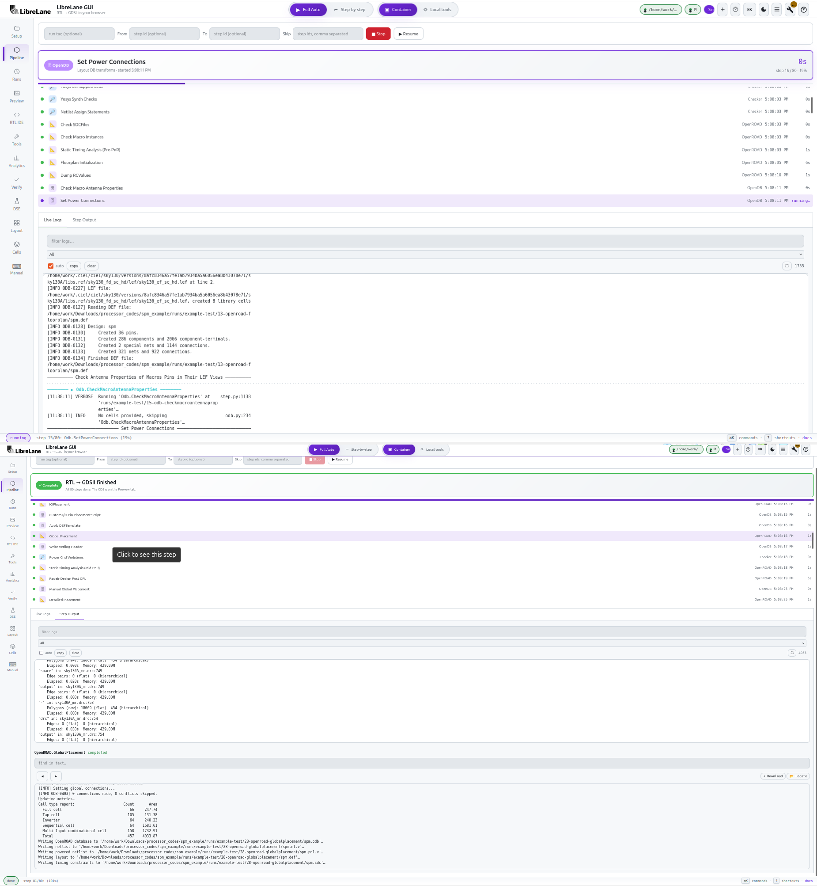
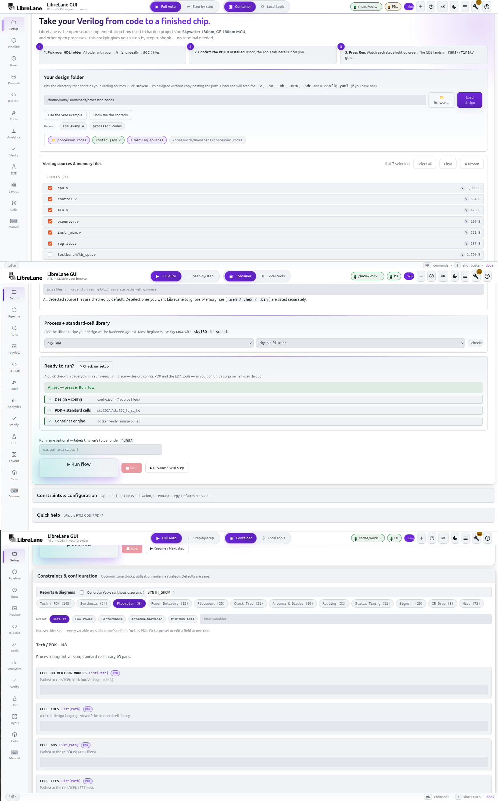
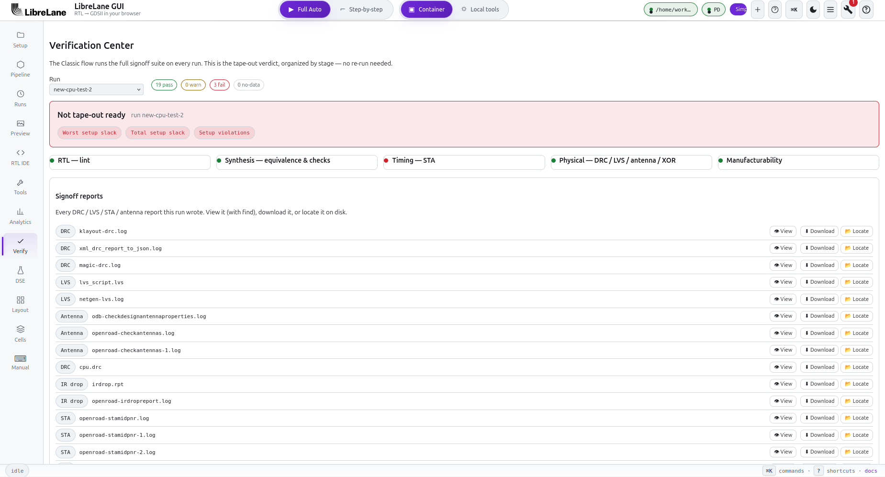
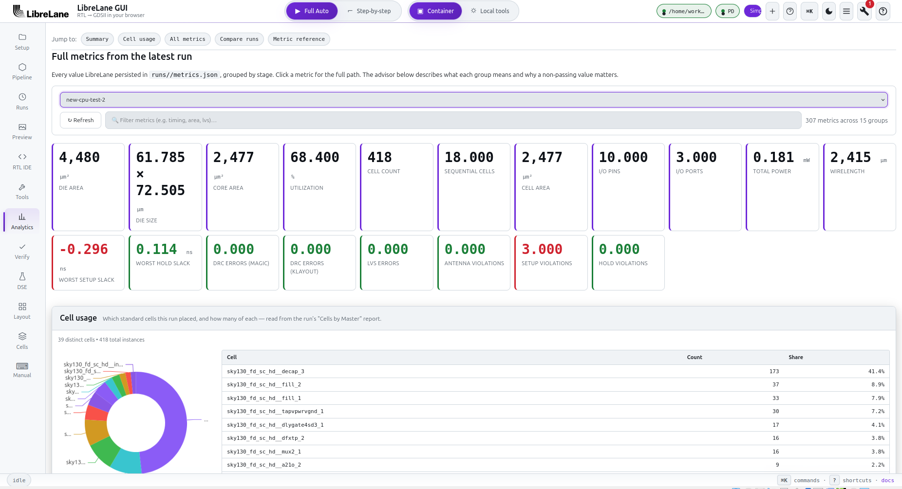
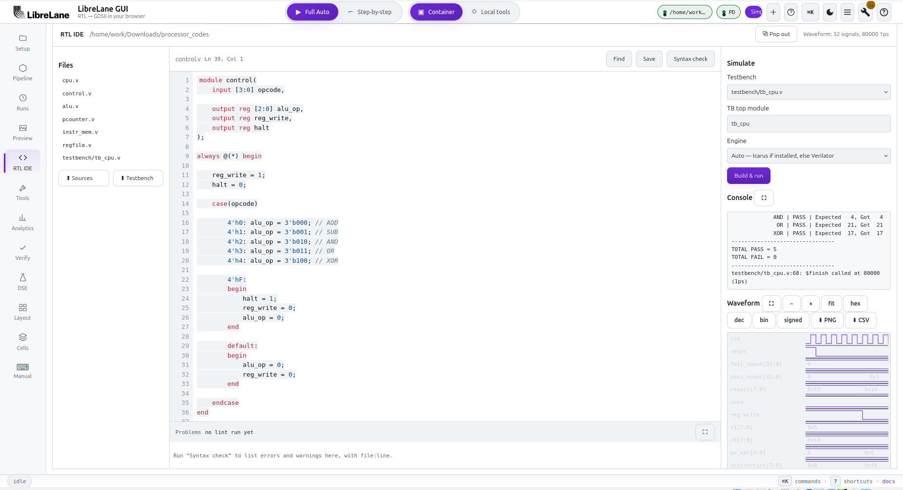
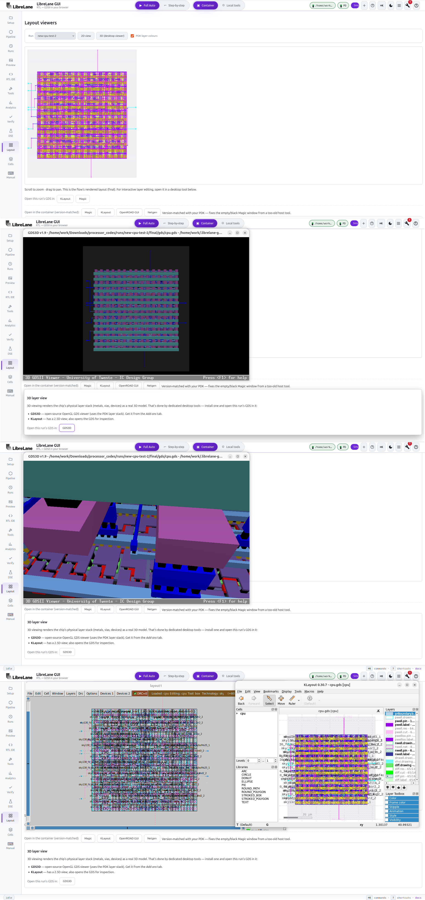
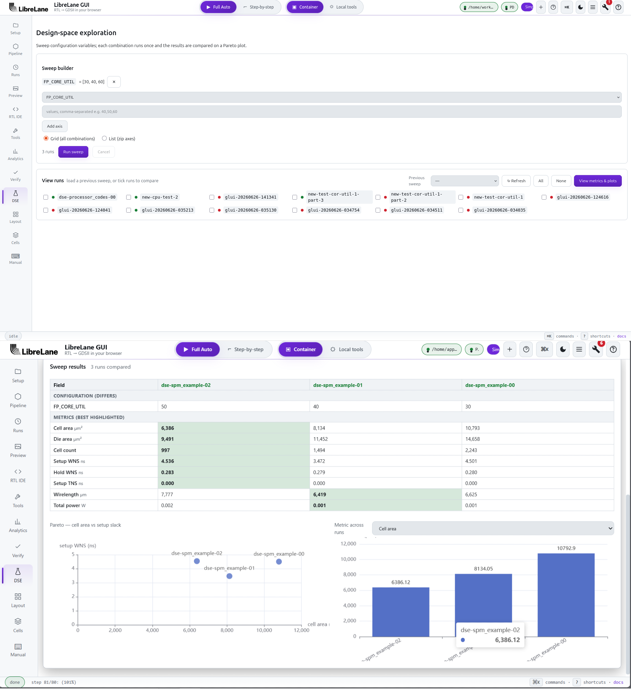

<!-- LanEx — README -->
<div align="center">

<picture>
  <source media="(prefers-color-scheme: dark)" srcset="lanex/server/static/vendor/lanex-logo-dark.png">
  
</picture>

### Take Verilog all the way to silicon — without living in a terminal.

A cockpit &amp; IDE for the [**LibreLane**](https://github.com/librelane/librelane) RTL&nbsp;→&nbsp;GDSII chip flow.

<br>

[](LICENSE)
[](https://www.python.org/)
[](#architecture)
[](#testing)
[](https://github.com/librelane/librelane)

<a href="#install"><b>Install</b></a> &nbsp;·&nbsp;
<a href="#quickstart"><b>Quickstart</b></a> &nbsp;·&nbsp;
<a href="#the-cockpit"><b>The&nbsp;cockpit</b></a> &nbsp;·&nbsp;
<a href="#gui--cli"><b>GUI&nbsp;↔&nbsp;CLI</b></a> &nbsp;·&nbsp;
<a href="#architecture"><b>Architecture</b></a>

<br>



</div>

---

> ### ⚠&nbsp; LanEx is a viewer, not a sign-off tool
>
> LanEx drives LibreLane and the EDA tools it orchestrates (OpenROAD, Yosys,
> Magic, KLayout, Netgen) and **displays their output**. It performs **no silicon
> analysis of its own** — every metric, report, and verdict it shows comes
> straight from those tools, passed through unmodified.
>
> **Do not fabricate from a LanEx verdict alone.** Before committing a design to
> manufacturing, always verify results against your foundry's official sign-off
> decks and your shuttle/MPW program's checks. LanEx is provided **AS&nbsp;IS,
> without warranty of any kind** (Apache-2.0 — see [LICENSE](LICENSE) and
> [NOTICE](NOTICE)).
>
> **LanEx is under active development and testing.** It passes tool output through
> unmodified, but a display or data-parsing error cannot be fully excluded. **If you
> intend to manufacture, run the LibreLane flow directly — independent of LanEx —
> and base your decision on its native output** as well. Treat LanEx as a
> convenience layer over the tools, not a replacement for their authoritative
> results; you assume all risk of relying on it. This safeguards the irreversible
> step of committing silicon and does not diminish LanEx's day-to-day accuracy.

---

## Contents

- [Why LanEx](#why-lanex)
- [The cockpit](#the-cockpit)
- [Install](#install)
- [Quickstart](#quickstart)
- [GUI ↔ CLI](#gui--cli)
- [Architecture](#architecture)
- [Testing](#testing)
- [Relationship to LibreLane](#relationship-to-librelane)
- [License](#license)

---

## Why LanEx

LibreLane is powerful, but terminal-first: you hand-write a `config.json`, learn
an ~80-step flow, install a compatible toolchain, and read raw logs to find out
why a run failed. **LanEx** ("lane extender") puts a real, reactive GUI on top —
and it is honest by design: **it renders exactly what the tools emit and computes
no numbers itself.**

|  | |
|---|---|
| **▸ Runs the flow for real** | Not a mock-up. Drives `librelane`, streams true per-step status over SSE, parses the real `metrics.json`. |
| **▸ RTL IDE** | Edit Verilog with syntax highlighting; lint and simulate (Verilator / Icarus) with a built-in VCD waveform viewer. |
| **▸ Verification Center** | DRC / LVS / antenna / timing roll-up by signoff stage, with an honest **3-state** verdict — it never flashes green "tape-out ready" for an incomplete run. |
| **▸ Provenance everywhere** | Every displayed number and setting traces to the tool's own file — one click opens the raw `metrics.json` / `resolved.json` / report with the exact line highlighted. A **Final settings** preview shows what a run will send (your overrides vs your config's lines vs defaults), and Analytics' **Final settings used** lists every variable a run resolved with its source. |
| **▸ Analytics &amp; DSE** | Metric trends, run comparison, and design-space sweeps. |
| **▸ Real layout viewers** | Opens the actual GDS in KLayout / Magic / GDS3D / OpenROAD GUI; renders previews inline. |
| **▸ Tool &amp; PDK management** | Detects what's installed and installs what's missing — one click. |

LanEx is a **standalone, independent project** built on LibreLane. It is not
affiliated with or endorsed by the LibreLane project or its maintainers.

---

## The cockpit

<div align="center">

| Setup | Verification | Analytics |
|:---:|:---:|:---:|
|  |  |  |
| **RTL IDE** | **Layout** | **Design-space exploration** |
|  |  |  |

<sub>More in <a href="docs/screenshots/"><code>docs/screenshots/</code></a></sub>

</div>

---

## Install

LanEx is a small Python app — the standard library plus `librelane`. Install it
once; from there it can **install LibreLane and every EDA tool for you** (one
version-matched container image — no native EDA installs on any platform), or
plug straight into a toolchain you already run.

<table>
<tr><th align="left" width="215">Your machine</th><th align="left">Do this</th></tr>

<tr><td><b>Windows</b><br><sub>10 version 2004+ or 11, 64-bit</sub></td>
<td>

Download **[LanEx-Setup.exe](https://github.com/AkshatIsWired/lanex/releases/latest)**
and click through it. You get a Start-menu app; there is no terminal step at any
point.

Everything LanEx needs — Ubuntu, Docker, the tools — goes into an isolated
environment of its own, so it never touches the rest of your PC (including any
WSL distros you already have), and uninstalling removes every trace. About five
minutes, plus a one-time ~3 GB toolchain download on first launch.
[What it actually does →](docs/INSTALL.md#windows-details)</td></tr>

<tr><td><b>Linux / macOS</b><br><sub>or a WSL2 distro you manage yourself</sub></td>
<td>

```bash
curl -fsSL https://raw.githubusercontent.com/AkshatIsWired/lanex/main/scripts/install.sh | bash
```

One command, any major distro (Debian/Ubuntu, Fedora, Arch, openSUSE), macOS 13+,
or inside WSL2. It detects your system, installs what a fresh machine is missing,
puts the `lanex` command on your PATH, and pre-pulls the version-matched
LibreLane image if you have Docker or Podman. Every step has a fallback, so it
lands on any supported machine. Safe to re-run — **a re-run upgrades LanEx in
place**. Then launch it with:

```bash
lanex
```

Don't prefix it with `sudo`: it asks for sudo itself only where needed, and
refuses to run under `sudo` outright (that's how installs end up in root's
home).</td></tr>

<tr><td><b>Anything else</b></td>
<td>

Per-distro manual steps, installing into an existing LibreLane environment, the
manual WSL2 path, updating, uninstalling, and troubleshooting all live in
**[docs/INSTALL.md](docs/INSTALL.md)**.</td></tr>
</table>

> **Prerequisites** for the Linux/macOS path: Python ≥ 3.10, and Docker or Podman
> — recommended but **optional**, because LanEx's Tools tab can install an engine
> for you. The Windows installer needs neither: it brings its own.

The UI opens in its **own app window** — a standalone window with its own taskbar
entry, no tabs and no URL bar (it renders with your installed Chrome/Edge/
Chromium; with none installed it falls back to a browser tab, and `lanex --tab`
forces one).

---

## Quickstart

```bash
lanex                                  # localhost cockpit in its own app window
lanex --tab                            # …in a normal browser tab instead
lanex --design-dir path/to/my_chip     # open already pointed at a design
lanex --no-browser --port 9000         # headless / custom port
lanex --host 0.0.0.0 --allow-remote    # expose on your network (no auth — take care)
```

**Your first chip in five clicks:**

1. **Setup** → pick your HDL folder (or click **Use the SPM example**).
2. **Tools** → click **Pull image** (recommended: one download = every EDA tool,
   version-matched — no native installs). Keep the **Container** engine selected.
3. Confirm the **PDK** + standard-cell library match your target.
4. Choose **Full Auto** or **Step-by-step** in the top bar.
5. Press **Run**. Watch the pipeline light up; the GDS lands on **Preview**.

### The tabs

| Tab | What it does |
|-----|--------------|
| **Setup** | Pick design, PDK/SCL, flow; auto-generate a config. Every constraint field shows LibreLane's default AND what your config file sets (exact line, scoped sections labelled); a **Final settings** dialog previews everything the run will send and why. |
| **Pipeline** | Live per-step run timeline + logs + step output. |
| **RTL IDE** | Edit / lint / simulate Verilog; VCD waveform viewer + one-click GTKWave. |
| **Verification** | DRC / LVS / antenna / timing signoff verdict — every check carries a source button opening the raw tool report with the verdict line highlighted. |
| **Analytics** | Metric trends, run comparison, cell usage. Every metric has a source button opening the run's own `metrics.json` at the exact line the number came from. **Final settings used** lists all ~400 variables the run resolved — values verbatim from `resolved.json`, each attributed to your override, your config line, or a default — filterable and CSV-exportable. |
| **DSE** | Design-space sweeps and result viewer. |
| **Layout** | Open GDS in KLayout / Magic / GDS3D / OpenROAD. |
| **Cells &amp; Macros** | PDK std cells; insert custom cells + hard macros. |
| **Runs** | Browse history; pin, import, export, and bundle runs. |

---

## GUI ↔ CLI

LanEx never hides what it runs. Everything it does maps onto the ordinary
`librelane` CLI, and the **Manual** tab's **Reveal CLI** button always prints the
*exact* command for your current design, config, and overrides (container or
local). That button is authoritative; the table below is the quick mental model.

| GUI action | Equivalent CLI |
|-----------|----------------|
| Setup → **Run** (container) | `librelane --dockerized <config> --pdk <PDK> --scl <SCL>` |
| Setup → **Run** (local tools) | `librelane <config> --pdk <PDK> --scl <SCL>` |
| Pipeline **From / To / Skip** | `librelane … --from <Step> --to <Step> --skip <Step>` |
| Setup → **Run name** | `librelane … --run-tag <name>` |
| Verify → **re-run a check** | `librelane … --last-run --to <Checker>` |
| Runs → **Reproduce** | replays the run's persisted `gui-run.json` command verbatim |
| Manual tab console | runs the allow-listed tool you type, and streams its output |

Config overrides set in the form are passed as `-c KEY=VALUE` (plus a
`.gui-*.json` overlay for the nested `MACROS` / custom-cell variables a flat `-c`
string can't express). Reveal CLI shows the fully-expanded command, so you can
paste it into a terminal and get byte-identical behaviour.

---

## Architecture

LanEx is built to keep both the install and the trust surface small.

- **A pure-Python controller.** `lanex/controller/` imports only `librelane.*`
  and the standard library — no web framework, no ORM, no bundler. It never
  touches HTTP directly; it is the faithful, upstream-mergeable core.
- **A stdlib server.** `lanex/server/` is a `http.server` + Server-Sent-Events
  backend. Zero third-party runtime dependencies.
- **A vanilla frontend.** ES modules with a single vendored copy of ECharts — no
  React, no TypeScript, no build step.
- **Faithful by construction.** LanEx renders exactly what the tools emit. A
  golden-corpus regression suite and a startup compatibility probe fail loudly if
  the installed `librelane` ever drifts from what LanEx parses, so displayed
  numbers can't silently go wrong.

```
lanex/
├─ controller/   pure-Python core (librelane + stdlib only)
├─ server/       http.server + SSE; no third-party deps
│  └─ static/    vanilla ES-module SPA + vendored ECharts
└─ tests/        684 tests, incl. golden-run + fidelity corpus
```

---

## Testing

```bash
pip install pytest
python3 -m pytest lanex/tests -q     # 684 passed, 3 skipped
```

The suite includes a golden-run corpus (a clean run and a non-finite-metric run)
that locks LanEx's byte-faithful passthrough against regressions, plus a
fidelity layer: all three VCD parsers (product, browser viewer, CI reference)
must agree on one committed simulator dump; every golden metric must render
faithfully; provenance answers must be byte-identical to the files on disk; and
CI drives a real GTKWave under Xvfb to prove the waveform hand-off shows exactly
what the simulator wrote. GitHub Actions' Summary tab explains every test group
— and a completeness check fails CI if a test file ships without one.

---

## Relationship to LibreLane

LanEx is an independent project that **uses** LibreLane; it does not modify it.
LibreLane is licensed under Apache-2.0 and is invoked as an external program.
See [NOTICE](NOTICE) for attribution. LanEx is not affiliated with or endorsed by
the LibreLane project.

## License

[Apache License 2.0](LICENSE). Provided **AS&nbsp;IS, without warranty** — see the
sign-off disclaimer at the top of this file and in [NOTICE](NOTICE).

<div align="center"><sub>Built for the open-silicon community.</sub></div>
